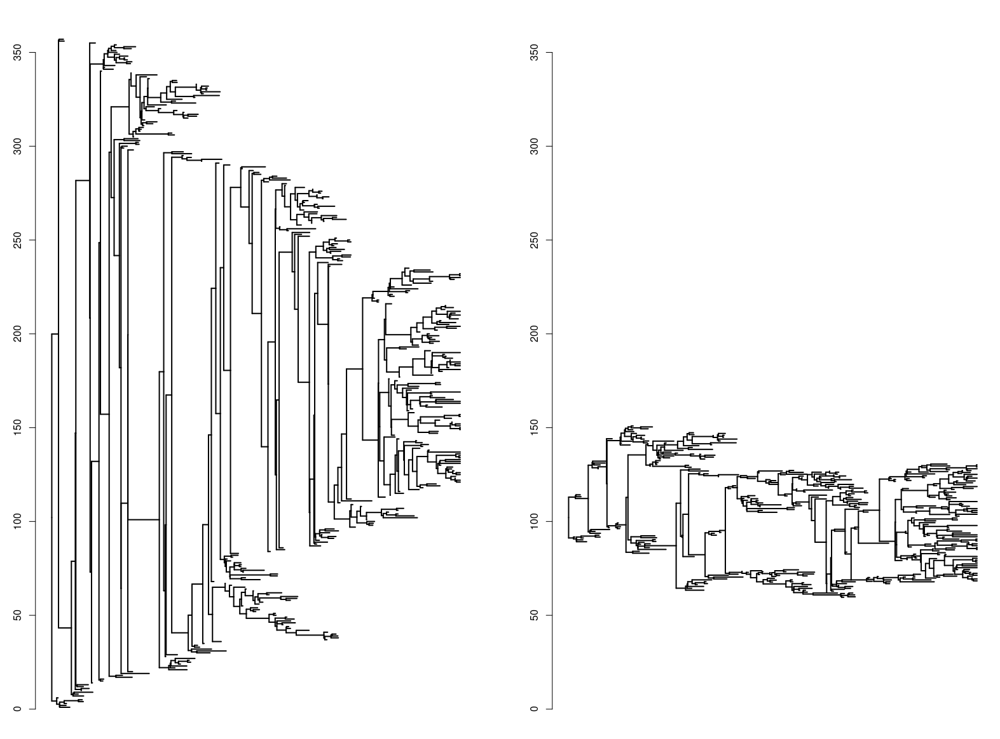

# Implementation of the non layered tidy tree layout for phylogenetic trees

Implementation of the algorithm in O(n) proposed in van der Ploeg, 2014 (https://onlinelibrary.wiley.com/doi/10.1002/spe.2213), adapted for plotting phylogenetic trees.

 -  `tidytree.R` contains functions implementing a standalone version of the algo, with basic functionality. The main function for plotting a tree in "tidy" mode is as follows.
```R
Usage:
     plot.tidy(x, show.tip.label=T, cex=1, x.lim = NULL, y.lim = NULL, 
     verbose=T, ...)
Arguments:
       x: an object of class ‘"phylo"’.
       show.tip.label: a logical indicating whether to show the tip labels on
          the phylogeny (defaults to ‘TRUE’, i.e. the labels are
          shown).
       cex: a numeric value giving the factor scaling of the tip and node
          labels (Character EXpansion). The default is to take the
          current value from the graphical parameters.
       x.lim: a numeric vector of length one or two giving the limit(s) of
          the x-axis. If ‘NULL’, this is computed with respect to
          various parameters such as the string lengths of the labels
          and the branch lengths. If a single value is given, this is
          taken as the upper limit.
       y.lim: same than above for the y-axis.
      verbose: a logical value specifying whether the degree of compression
          achieved (in %) should be reported. 
```

 - `plot.phylo.R` is a fork of the same script in the ape package, but including a new "type" of phylogeny: "tidy". Refer to the help page of plot.phylo() in ape for details. Using this function with the tidy option is as simple as: 
```R
	plot(tr, type="tidy", ...)
```
All options available in plot.phylo can also be used here. Only the option for aligning tips (`align.tip.label`) will give ugly results because the new layout breaks the uniform distribution of the tips along the y-axis. 

---------------------------------
If you are curious about this new layout, here is how it looks like: On the left, the tree before compression (`type="phylogram"`). On the right the same tree after compression (`type="tidy"`). 


--------------------------------
For questions/remarks/bug reports, please contact Damien de Vienne : damien.de-vienne@univ-lyon1.fr
